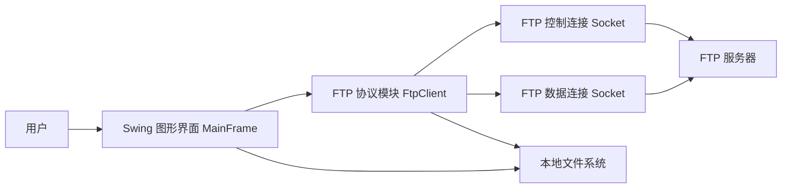
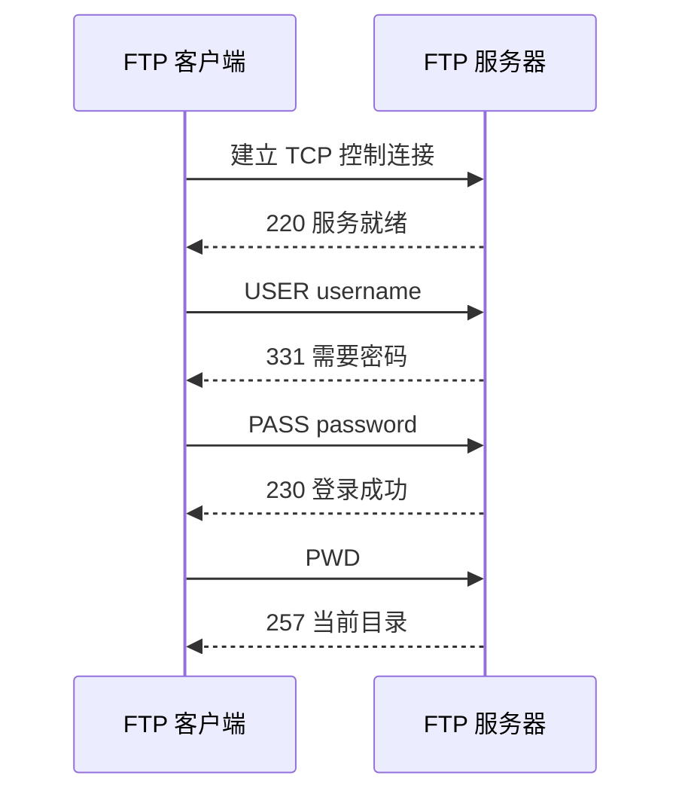
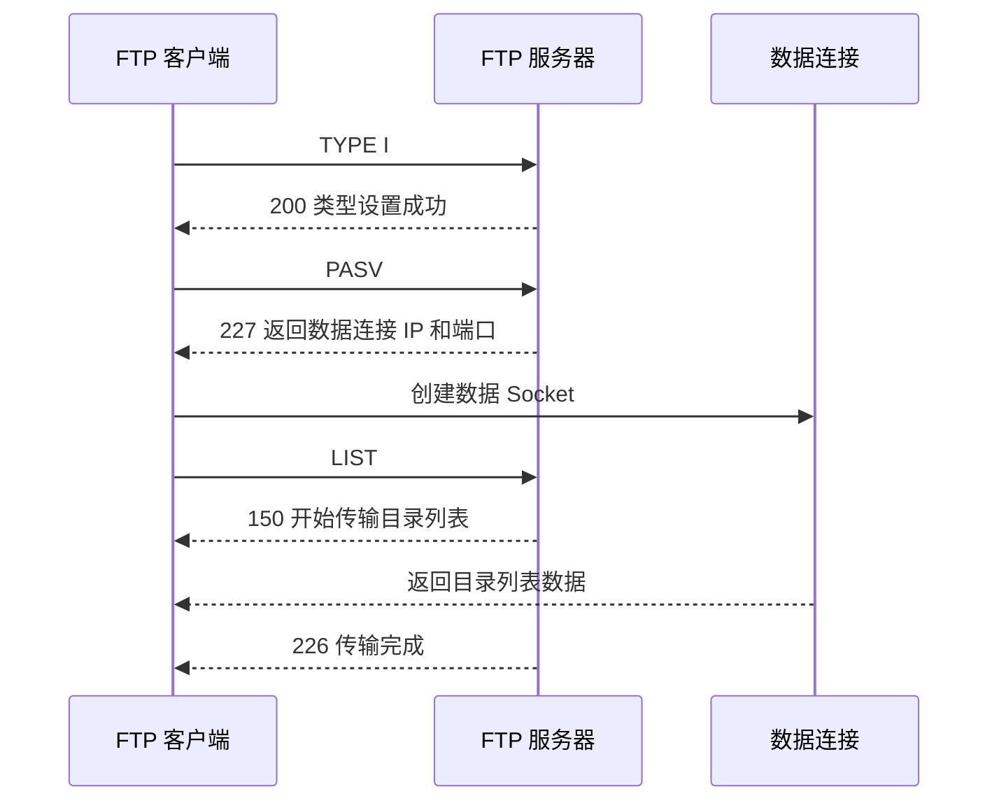
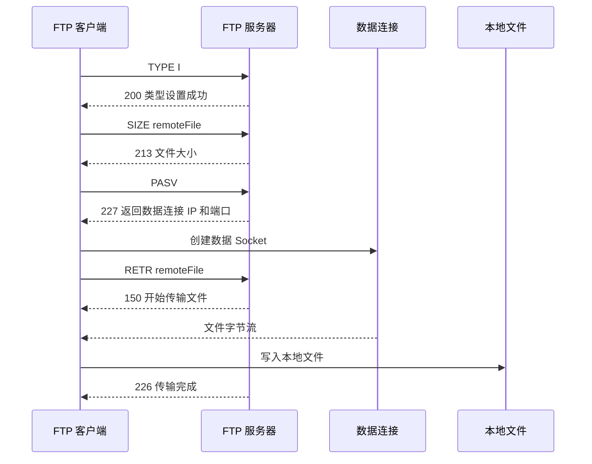
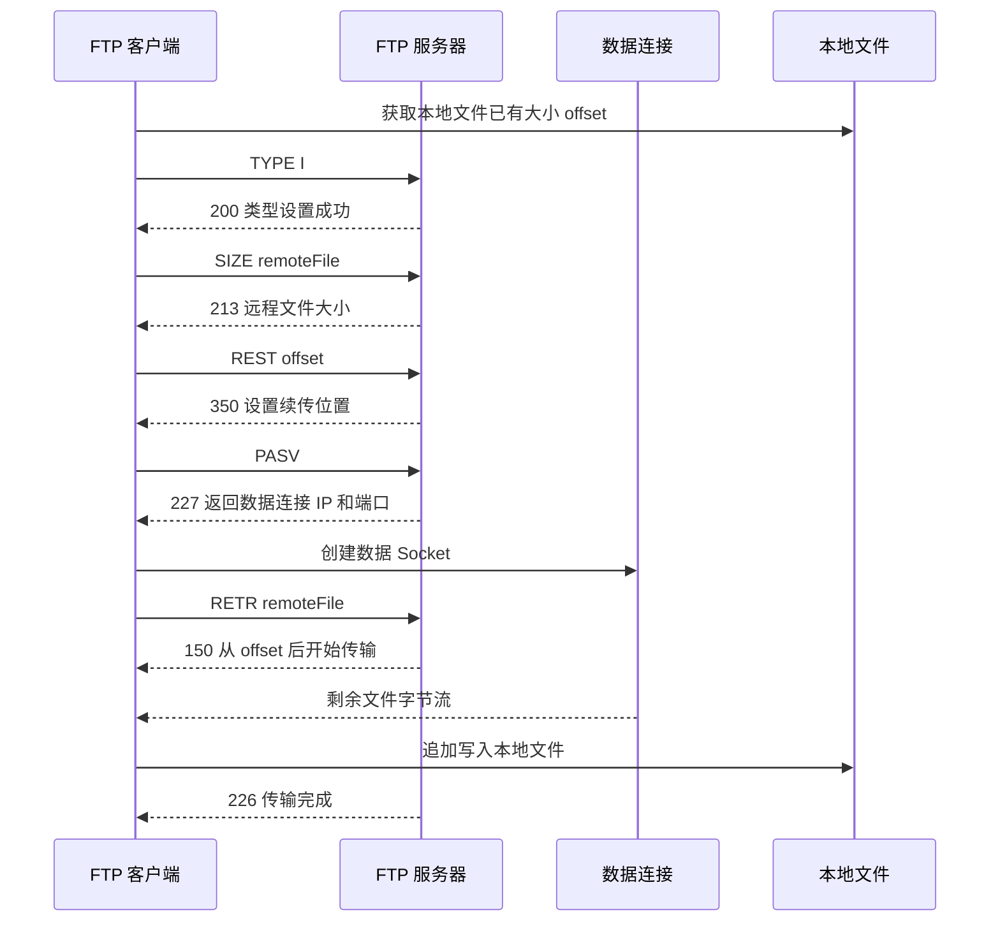
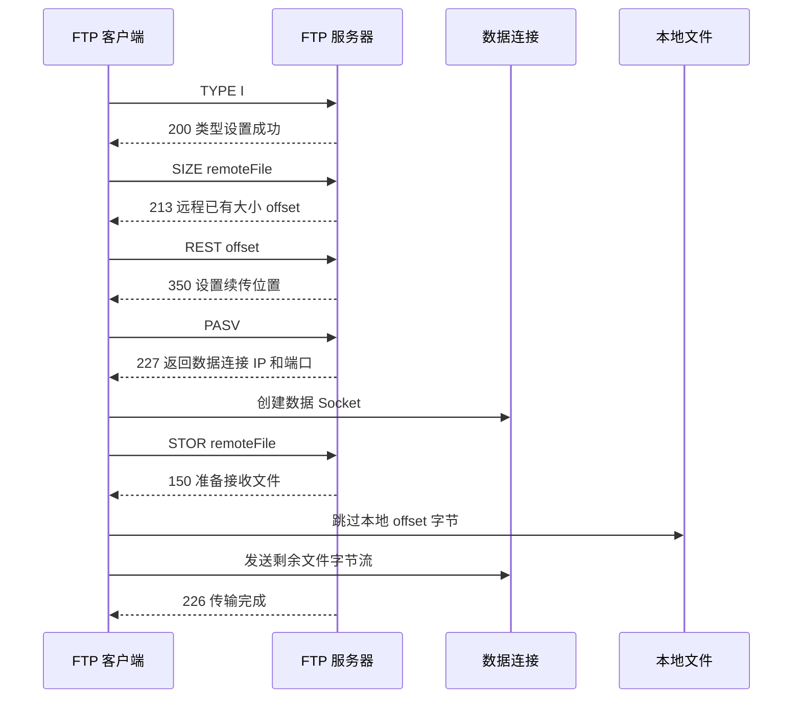

# FTP 客户端实验报告材料

本文档用于整理实验报告中的系统设计、协议流程图、核心代码说明、功能截图清单和小组分工表。内容可根据实验报告模板复制到对应章节中。

## 一、系统设计

### 1. 系统目标

本项目实现一个基于 FTP 协议的图形化客户端程序。客户端运行在 Windows 或支持 Java 图形界面的系统上，能够通过 TCP Socket 与 FTP 服务器建立连接，并完成登录、目录浏览、文件上传、文件下载和断点续传等功能。

根据课程要求，本项目没有调用第三方 FTP 客户端库，而是使用 Java 原生 `java.net.Socket` 从创建 TCP 连接开始实现 FTP 协议交互。FTP 控制连接用于发送命令和接收服务器响应，FTP 数据连接用于目录列表和文件内容传输。

### 2. 技术选型

- 编程语言：Java
- 图形界面：Swing
- 网络通信：`java.net.Socket`
- 测试服务器：项目内置 Python FTP 测试服务器
- 构建方式：`javac` + `jar`，不依赖 Maven 或 Gradle

选择 Java 的原因是跨平台性较好，可以在 WSL2 中开发和编译，也可以打包成 jar 在 Windows 上运行。Swing 是 JDK 自带的图形界面库，不需要额外安装依赖，适合课程实践项目展示。

### 3. 系统模块划分

系统主要分为四个模块：

| 模块 | 主要文件 | 职责 |
| --- | --- | --- |
| 程序入口模块 | `FtpClientApp.java` | 初始化 Swing 图形界面并启动主窗口 |
| FTP 协议模块 | `FtpClient.java`、`FtpReply.java`、`FtpFile.java`、`TransferProgress.java` | 建立 Socket 连接、发送 FTP 命令、解析响应、创建数据连接、执行上传下载和断点续传 |
| 图形界面模块 | `MainFrame.java` | 提供服务器连接表单、远程目录列表、本地文件选择、上传下载按钮、进度条和日志显示 |
| 测试辅助模块 | `dev_ftp_server.py`、`FtpSmokeTest.java` | 提供本地 FTP 测试服务和命令行冒烟测试 |

### 4. 总体架构



系统运行时，用户在图形界面中输入服务器地址、端口、用户名和密码。界面层调用 `FtpClient` 完成 FTP 协议操作。`FtpClient` 内部维护控制连接，并在需要传输目录或文件数据时，通过 `PASV` 命令创建临时数据连接。

### 5. 控制连接和数据连接设计

FTP 协议使用两类 TCP 连接：

- 控制连接：客户端连接服务器的 FTP 端口，发送 `USER`、`PASS`、`PWD`、`CWD`、`PASV`、`LIST`、`RETR`、`STOR`、`REST` 等命令。
- 数据连接：客户端发送 `PASV` 命令后，根据服务器返回的 IP 和端口创建新的 Socket，用于目录列表、文件上传和文件下载。

本项目采用被动模式传输数据。被动模式更适合客户端处在 NAT、WSL2 或防火墙环境下的情况，因为数据连接由客户端主动连接服务器提供的端口。

## 二、协议流程图

### 1. 登录流程



登录时客户端首先创建控制连接，读取服务器欢迎响应。随后发送 `USER` 和 `PASS` 命令完成用户认证。登录成功后发送 `PWD` 获取当前远程目录。

### 2. 目录浏览流程



目录浏览使用 `LIST` 命令。发送 `LIST` 前，客户端先通过 `PASV` 进入被动模式并创建数据连接，然后从数据连接读取目录列表内容。

### 3. 下载流程



普通下载时，客户端使用 `RETR` 命令从服务器获取远程文件内容，并将数据连接中的字节流写入本地文件。

### 4. 断点续传下载流程



断点续传下载的关键是客户端先获取本地残缺文件大小，然后发送 `REST offset` 命令通知服务器从指定偏移量继续传输，最后使用 `RETR` 下载剩余内容并追加到本地文件。

### 5. 上传和断点续传上传流程



上传时使用 `STOR` 命令。断点续传上传时，客户端先通过 `SIZE` 查询服务器端已存在文件大小，再发送 `REST offset`，随后跳过本地文件中已上传的部分，只发送剩余字节。

## 三、核心代码说明

### 1. 程序入口

`FtpClientApp.java` 是程序入口。程序启动后调用 `SwingUtilities.invokeLater` 创建 `MainFrame`，保证 Swing 界面在事件派发线程中初始化。

主要职责：

- 设置系统默认 Look and Feel。
- 创建并显示主窗口。

### 2. FTP 协议客户端

核心实现位于 `FtpClient.java`。该类维护 FTP 控制连接，并提供登录、目录浏览、上传、下载和断点续传方法。

#### 建立控制连接

`connect(String host, int port)` 使用 `new Socket(host, port)` 建立 TCP 控制连接，然后创建字符输入输出流读取服务器响应。

关键点：

- 控制连接长期保持，用于发送 FTP 命令。
- 每条 FTP 命令以 `\r\n` 结尾。
- 服务器响应以三位数字响应码开头。

#### 发送命令和读取响应

`sendCommand(String command)` 负责向控制连接写入命令并读取响应。`readReply()` 支持单行响应和多行响应。如果响应格式为 `123-...`，则持续读取直到出现 `123 ...` 结束行。

这种设计保证了客户端可以正确处理 `FEAT` 等多行响应，也能处理普通的 `220`、`230`、`226` 等单行响应。

#### 被动模式数据连接

`openPassiveDataSocket()` 先发送 `PASV` 命令，解析服务器返回的 `227 Entering Passive Mode (...)` 响应，从中提取 IP 和端口，然后创建新的 Socket 连接数据端口。

使用被动模式的原因：

- 数据连接由客户端主动发起。
- 更适合 WSL2、NAT 和防火墙环境。
- 上传、下载、目录列表都可以复用同一套数据连接创建逻辑。

#### 远程目录列表

`listFiles()` 的执行顺序为：

1. 发送 `TYPE I` 设置二进制模式。
2. 发送 `PASV` 并创建数据连接。
3. 发送 `LIST` 命令。
4. 从数据连接读取目录列表。
5. 读取控制连接上的 `226 Transfer complete` 响应。
6. 将每一行目录信息解析成 `FtpFile` 对象。

#### 文件下载

`download(String remoteFile, Path localFile, boolean resume, TransferProgress progress)` 实现普通下载和续传下载。

普通下载时，本地文件使用覆盖写入方式。续传下载时，客户端先读取本地已有文件大小，如果大小大于 0，则发送 `REST offset`，随后发送 `RETR remoteFile`，并以追加方式写入本地文件。

#### 文件上传

`upload(Path localFile, String remoteFile, boolean resume, TransferProgress progress)` 实现普通上传和续传上传。

普通上传直接从本地文件开头读取并发送。续传上传时，客户端先通过 `SIZE remoteFile` 获取服务器端已存在文件大小，然后发送 `REST offset`，本地文件输入流跳过 offset 字节后继续发送剩余数据。

#### 进度回调

`TransferProgress` 是传输进度回调接口。上传和下载过程中，`copy()` 方法每传输一段数据都会调用 `onProgress(transferredBytes, totalBytes)`，图形界面据此更新进度条。

### 3. 图形界面

图形界面位于 `MainFrame.java`，主要由三部分组成：

- 顶部连接区域：主机、端口、用户名、密码、连接、断开。
- 中部远程目录区域：当前路径、刷新、上级、进入目录、远程文件列表。
- 下部文件传输区域：本地文件选择、下载、续传下载、上传、续传上传、日志和进度条。

所有网络操作都通过 `SwingWorker` 放在后台线程执行，避免上传、下载或网络等待时阻塞 GUI。操作完成后再更新按钮状态、目录列表和日志内容。

### 4. 本地测试服务器

`tools/dev_ftp_server.py` 是用于开发测试的轻量级 FTP 服务器。它支持课程项目中需要的常用命令：

- `USER`
- `PASS`
- `PWD`
- `CWD`
- `TYPE`
- `PASV`
- `LIST`
- `SIZE`
- `REST`
- `RETR`
- `STOR`
- `QUIT`

该服务器只用于本地开发和演示，不作为最终客户端功能的一部分。它可以帮助组员在没有真实 FTP 服务器的情况下完成测试。

### 5. 命令行测试程序

`FtpSmokeTest.java` 用于在没有 GUI 环境时验证核心 FTP 功能。它会自动连接本地测试服务器，依次执行登录、目录列表、下载、续传下载、上传和续传上传，用于快速确认协议层代码是否正常。

## 四、功能截图清单

实验报告建议放入以下截图。截图时可以先启动本地 FTP 测试服务器，再运行 GUI 客户端。

| 序号 | 截图名称 | 截图内容 | 建议文件名 |
| --- | --- | --- | --- |
| 1 | 程序主界面 | GUI 启动后显示主机、端口、用户、密码输入框和操作区域 | `01-main-window.png` |
| 2 | 连接成功 | 输入 `127.0.0.1:2121` 后连接成功，日志显示 `220`、`230`、`257` 响应 | `02-connect-success.png` |
| 3 | 远程目录浏览 | 远程目录列表显示 `hello.txt` 等文件 | `03-list-files.png` |
| 4 | 文件下载 | 选择远程文件并下载，日志显示下载完成 | `04-download.png` |
| 5 | 文件上传 | 选择本地文件并上传，远程目录刷新后显示新文件 | `05-upload.png` |
| 6 | 续传下载 | 使用“续传下载”按钮，日志显示下载完成 | `06-resume-download.png` |
| 7 | 续传上传 | 使用“续传上传”按钮，日志显示上传完成 | `07-resume-upload.png` |
| 8 | 命令行测试 | 运行 `FtpSmokeTest` 后显示所有测试通过的终端输出 | `08-smoke-test.png` |

截图操作命令：

```bash
python3 tools/dev_ftp_server.py --host 127.0.0.1 --port 2121 --root ftp-root
```

另开终端：

```bash
./scripts/package.sh
java -jar dist/cs-net-lab-ftp-client.jar
```

如果 WSL2 无法显示 GUI，可在 Windows PowerShell 中运行 jar，并连接 WSL2 中启动的测试服务器。

## 五、测试用例表

| 测试编号 | 测试功能 | 前置条件 | 操作步骤 | 预期结果 |
| --- | --- | --- | --- | --- |
| TC-01 | 连接登录 | FTP 测试服务器已启动 | 输入主机、端口、用户名、密码，点击连接 | 日志显示 `220`、`230`，远程目录列表刷新 |
| TC-02 | 目录浏览 | 已登录 | 点击刷新或进入目录 | 列表显示远程目录和文件 |
| TC-03 | 文件下载 | 已登录，远程存在文件 | 选择远程文件，点击下载，选择保存路径 | 本地生成完整文件，日志显示下载完成 |
| TC-04 | 文件上传 | 已登录，本地存在文件 | 选择本地文件，点击上传 | 远程目录出现上传文件，日志显示上传完成 |
| TC-05 | 断点续传下载 | 本地存在同名残缺文件 | 选择远程文件，点击续传下载，选择残缺文件 | 客户端发送 `REST`，本地文件补全 |
| TC-06 | 断点续传上传 | 远程存在残缺文件 | 选择完整本地文件，点击续传上传 | 客户端查询远程大小并续传剩余部分 |
| TC-07 | 断开连接 | 已登录 | 点击断开 | 客户端发送 `QUIT` 并释放连接 |

## 六、小组分工表

下面是可直接放入实验报告的分工表模板。姓名和学号根据实际小组成员填写。

| 成员 | 学号 | 主要任务 | 负责源码/文档 |
| --- | --- | --- | --- |
| 成员 A | 待填写 | 项目整体设计、FTP 协议流程设计、控制连接实现 | `FtpClient.java` 中连接、登录、命令发送和响应解析部分 |
| 成员 B | 待填写 | FTP 数据连接、目录浏览、上传下载实现 | `FtpClient.java` 中 `PASV`、`LIST`、`RETR`、`STOR` 部分 |
| 成员 C | 待填写 | 断点续传设计与实现、进度回调 | `FtpClient.java` 中 `REST`、续传上传、续传下载、`TransferProgress.java` |
| 成员 D | 待填写 | 图形界面设计与事件处理 | `MainFrame.java` |
| 成员 E | 待填写 | 本地测试服务器、命令行测试、功能测试截图 | `dev_ftp_server.py`、`FtpSmokeTest.java`、测试截图 |
| 成员 F | 待填写 | 实验报告撰写、系统设计图、测试用例整理 | `README.md`、`docs/report-materials.md`、实验报告 Word 文档 |

如果小组人数少于 6 人，可以合并任务。例如 4 人小组可以采用如下分工：

| 成员 | 学号 | 主要任务 | 负责源码/文档 |
| --- | --- | --- | --- |
| 成员 A | 待填写 | FTP 协议控制连接、响应解析、总体设计 | `FtpClient.java` 基础协议部分 |
| 成员 B | 待填写 | 数据连接、上传、下载、断点续传 | `FtpClient.java` 文件传输部分 |
| 成员 C | 待填写 | GUI 界面、按钮事件、进度条和日志 | `MainFrame.java` |
| 成员 D | 待填写 | 测试服务器、功能测试、实验报告和截图 | `dev_ftp_server.py`、`FtpSmokeTest.java`、实验报告 |

## 七、实验总结参考

通过本次实践，我们掌握了 FTP 协议中控制连接和数据连接的工作方式，理解了常见 FTP 命令的使用流程。项目中使用 Socket 手动实现命令发送、响应解析和数据传输，进一步加深了对 TCP 连接、客户端/服务器通信模型以及应用层协议设计的理解。

在实现过程中，文件传输采用被动模式 `PASV`，减少了 NAT 和防火墙环境对数据连接的影响。断点续传功能通过 `REST` 命令指定文件偏移量，在下载时根据本地文件大小继续接收数据，在上传时根据远程文件大小跳过本地已上传部分继续发送数据。图形界面使用后台线程处理网络操作，避免了界面阻塞，提高了程序可用性。

本项目完成了课程要求中的 FTP 客户端图形化界面、上传、下载和断点续传功能，并提供了本地测试服务器和命令行测试程序，便于开发、演示和验收。
